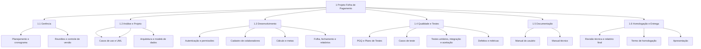

# 5.8 Planejamento do Projeto

## EAP (Estrutura Analítica do Projeto)

```mermaid
flowchart TD
    P["1 Projeto Folha de Pagamento"] --> G["1.1 Gerência"]
    P --> A["1.2 Análise e Projeto"]
    P --> D["1.3 Desenvolvimento"]
    P --> Q["1.4 Qualidade e Testes"]
    P --> M["1.5 Documentação"]
    P --> H["1.6 Homologação e Entrega"]
    G --> G1["Planejamento e cronograma"]
    G --> G2["Reuniões e controle de versão"]
    A --> A1["Visão e ERS"]
    A --> A1["Casos de uso e UML"]
    A --> A3["Arquitetura e modelo de dados"]
    D --> D1["Autenticação e permissões"]
    D --> D2["Cadastro de colaboradores"]
    D --> D3["Cálculo e metas"]
    D --> D4["Folha, fechamento e relatórios"]
    Q --> Q1["PGQ e Plano de Testes"]
    Q --> Q2["Casos de teste"]
    Q --> Q3["Testes unitários, integração e aceitação"]
    Q --> Q4["Defeitos e métricas"]
    M --> M1["Manual do usuário"]
    M --> M2["Manual técnico"]
    H --> H1["Revisão técnica e relatório final"]
    H --> H2["Termo de homologação"]
    H --> H3["Apresentação"]
```